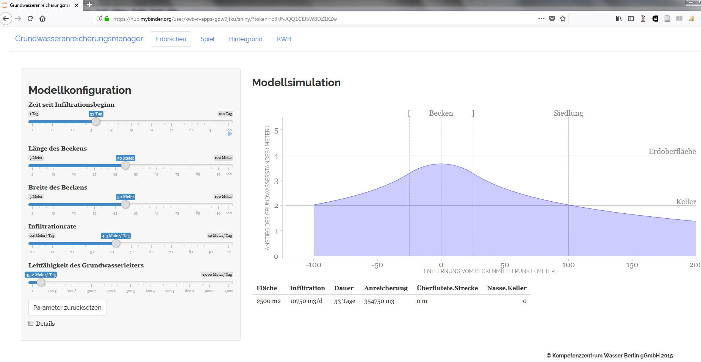

# apps

Interactive Apps

The following apps are based on the following different R packages:

## [aquanes.report](https://kwb-r.github.io/aquanes.report)

Collects, aggregates and visualises operational and analytical data from water 
suppliers (including a standardised reporting document).

### Haridwar 

## [kwb.hantush](https://kwb-r.github.io/kwb.hantush)

An R package for calculating groundwater mounding beneath an infiltration basin
based on the [Hantush equation, 1967](http://doi.org/10.1029/WR003i001p00227).
 
 
### GWAmanager (in German) 
 

## [kwb.wtaq](https://kwb-r.github.io/kwb.wtaq) 

The R package **kwb.wtaq** provides a programmatic interface to the well drawdown model [WTAQ version 2.1](https://water.usgs.gov/ogw/wtaq/) (developed by the U.S. Geological Survey). The WTAQ 2.1 model 
engine is included in the package, but also available for download as [self-extracting win-zip file from the USGS](https://water.usgs.gov/ogw/wtaq/WTAQ_2.1.exe]) . 

### Interactive WTAQ 

